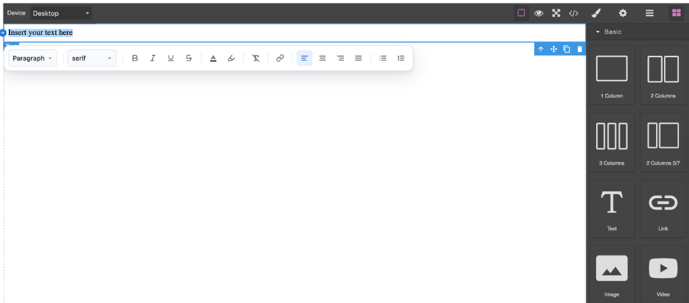

# grapesjs-plugin-scribejs



A professional GrapesJS plugin that replaces the built-in Rich Text Editor with [ScribeJS](https://scribejs.top) — a powerful, modern rich text editor with full formatting capabilities, customizable toolbar, and extensive API.

Demo: [https://devfuture.pro/live/scribejs/](https://devfuture.pro/live/scribejs/)

[](https://opensource.org/licenses/BSD-3-Clause)
[](https://www.npmjs.com/package/grapesjs-plugin-scribejs)

## ✨ Features

- 🎨 **Rich Text Editing** - Full-featured WYSIWYG editor with inline and block formatting
- 🛠️ **Customizable Toolbar** - Configure which tools appear, their position, and styling
- 🎯 **Flexible Positioning** - Left, center, or right-aligned toolbar with auto-positioning
- 📱 **Responsive** - Works seamlessly in iframe and non-iframe canvas modes
- 🔌 **Extensible** - Plugin system for adding custom functionality
- ♿ **Accessible** - Built-in keyboard shortcuts and ARIA labels
- 🎭 **Event-Driven** - Comprehensive callback system for lifecycle events
- ⚡ **Performance** - Debounced updates, instance caching, and lazy loading options

## 📦 Installation

```bash
npm install grapesjs-plugin-scribejs
# or
yarn add grapesjs-plugin-scribejs
```

## 🚀 Quick Start

```javascript
import grapesjs from 'grapesjs';
import grapesjsScribePlugin from 'grapesjs-plugin-scribejs';

const editor = grapesjs.init({
  container: '#gjs',
  plugins: [grapesjsScribePlugin],
  pluginsOpts: {
    [grapesjsScribePlugin]: {
      // Plugin options (see Configuration below)
      position: 'left',
      toolbar: {
        enabled: true,
      },
    }
  }
});
```

## ⚙️ Configuration

### Complete Options Reference

```typescript
{
  // ScribeJS Configuration
  scribeConfig?: Partial<ScribeConfig>;
  // Raw ScribeJS configuration forwarded to every editor instance
  // See ScribeJS documentation for available options

  // Toolbar Configuration
  toolbar?: {
    placement?: 'canvas-body' | 'canvas-overlay' | 'parent-document' | 'custom-container' | 'shadow-dom';
    container?: HTMLElement | string | null;
    flex?: boolean;
    wrap?: boolean;
    responsive?: boolean;
    groups?: Array<{
      name: string;
      items: string[];
      label?: string;
    }>;
    items?: (string | ToolbarItem)[];
    customRenderer?: (
      toolbar: HTMLElement,
      items: ToolbarItem[],
      formatState: FormatState | null,
    ) => void;
  },

  // Whether GrapesJS uses iframe canvas (auto-detected if omitted)
  iframe?: boolean;

  // External toolbar container (outside canvas)
  externalToolbarContainer?: HTMLElement | string | null;

  // Output format when syncing to GrapesJS model
  outputFormat?: 'html' | 'json' | 'both';

  // Automatically initialise ScribeJS on text component double-click
  autoInit?: boolean;  // default: true

  // Log debug info to console
  debug?: boolean;

  // Extra ScribeJS plugins to register
  plugins?: ScribePlugin[];

  // Feature flags
  features?: {
    tables?: boolean;
    media?: boolean;
    code?: boolean;
    collaboration?: boolean;
    variables?: boolean;
    widgets?: boolean;
  };

  // Debounce ms for content sync back to GrapesJS
  debounceMs?: number;  // default: 100

  // Extend the default customRTE interface
  customRte?: Partial<CustomRTE>;

  // Customize toolbar element once created
  onToolbar?: (toolbar: HTMLElement) => void;
}
```

## 📚 Usage Examples

### Basic Setup with Custom Toolbar

```javascript
const editor = grapesjs.init({
  container: '#gjs',
  plugins: [grapesjsScribePlugin],
  pluginsOpts: {
    [grapesjsScribePlugin]: {
      toolbar: {
        placement: 'canvas-overlay',
        flex: true,
        responsive: true,
      },
    }
  }
});
```

### With ScribeJS Configuration and Events

```javascript
const editor = grapesjs.init({
  container: '#gjs',
  plugins: [grapesjsScribePlugin],
  pluginsOpts: {
    [grapesjsScribePlugin]: {
      scribeConfig: {
        // Pass ScribeJS-specific config here
        placeholder: 'Start typing...',
        maxLength: 500,
      },
      onToolbar: (toolbar) => {
        console.log('Toolbar created:', toolbar);
      },
      debug: true,
    }
  }
});

// Listen to plugin events
editor.on('scribe:ready', ({ el, instance }) => {
  console.log('Editor initialized:', el);
});

editor.on('scribe:change', ({ el, html }) => {
  console.log('Content changed:', html);
});
```

### Using Feature Flags and Plugins

```javascript
const editor = grapesjs.init({
  container: '#gjs',
  plugins: [grapesjsScribePlugin],
  pluginsOpts: {
    [grapesjsScribePlugin]: {
      features: {
        tables: true,
        media: true,
        code: true,
        collaboration: false,
        variables: true,
        widgets: false,
      },
      plugins: [
        // Add custom ScribeJS plugins here
      ],
      debounceMs: 150,
    }
  }
});
```

### External Toolbar Container

```javascript
const editor = grapesjs.init({
  container: '#gjs',
  plugins: [grapesjsScribePlugin],
  pluginsOpts: {
    [grapesjsScribePlugin]: {
      externalToolbarContainer: '#my-toolbar-container',
      toolbar: {
        placement: 'custom-container',
        flex: true,
      },
      onToolbar: (toolbar) => {
        // Customize the toolbar after creation
        toolbar.style.background = '#1a1a1a';
      }
    }
  }
});
```

## 🔌 API Reference

### Extension API

The plugin exposes a ScribeJS extension API on the GrapesJS editor instance:

```javascript
const editor = grapesjs.init({ /* ... */ });

// Access the ScribeJS API
editor.ScribeJS.createInstance(element, config);
editor.ScribeJS.destroyInstance(element);
editor.ScribeJS.getInstance(element);
editor.ScribeJS.destroyAll();
editor.ScribeJS.registerPlugin(plugin);
editor.ScribeJS.getInstances();
```

### Events

The plugin emits the following events on the GrapesJS editor:

- `scribe:ready` - Fired when a ScribeJS instance is initialized
- `scribe:focus` - Fired when editor receives focus
- `scribe:blur` - Fired when editor loses focus
- `scribe:selectionChange` - Fired when text selection changes
- `scribe:change` - Fired when content changes
- `scribe:destroy` - Fired when instance is destroyed

```javascript
editor.on('scribe:ready', ({ el, instance }) => {
  console.log('ScribeJS ready on element:', el);
});

editor.on('scribe:selectionChange', ({ el, selection }) => {
  console.log('Selection changed:', selection);
});
```

## 🎨 Available Toolbar Items

The default toolbar includes these items (use `toolbar.items` or `toolbar.excludeItems` to customize):

- **Block Formatting**: `formatBlock` (paragraph, headings, blockquote)
- **Font**: `fontFamily`
- **Inline Formatting**: `bold`, `italic`, `underline`, `strike`
- **Colors**: `color`, `backgroundColor`
- **Formatting**: `clearFormat`
- **Links**: `link`
- **Alignment**: `alignLeft`, `alignCenter`, `alignRight`, `alignJustify`
- **Lists**: `orderedList`, `unorderedList`
- **Indentation**: `indent`, `outdent`
- **Code**: `code`, `codeBlock`
- **History**: `undo`, `redo`

## 🛠️ Development

```bash
# Install dependencies
npm install

# Start development server with live reload
npm start

# Build production bundle
npm run build

```

## 🤝 Contributing

Contributions are welcome! Please feel free to submit a Pull Request.

## 📄 License

BSD-3-Clause License - see [LICENSE](LICENSE) file for details.

## 👤 Author

- Website: [https://scribejs.top/](https://scribejs.top/)

## 🙏 Acknowledgments

- Built with [ScribeJS](https://scribejs.top) - Modern rich text editor
- Powered by [GrapesJS CLI](https://github.com/GrapesJS/cli)
- Integrates seamlessly with [GrapesJS](https://grapesjs.com)

## ⭐ Support Us

If you like this plugin, please give a star to this repository and [ScribeJS](https://github.com/GoodPHP/scribejs-editor). Thank you!

---

Made with ❤️ by the DevFuture team